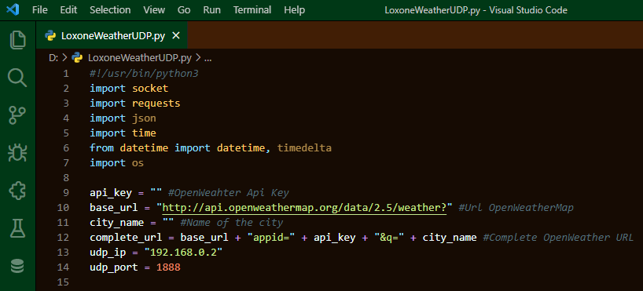

# Dark Forest
Dark Forest theme for VS Code. Great mix of green and brown.

   

## Screenshot
Screenshot of a Loxone-Weather-UDP written in Python

If you like this check out [Dark Forest](https://marketplace.visualstudio.com/items?itemName=wolfror.dark-forest)

## Changelog
You can take a look at the change log [here](https://github.com/WolfRorDev/dark-forest/blob/master/CHANGELOG.md)